what is a Git?
============

## Git의 세 가지 상태
1. **Committed** : 데이터가 *로컬 데이터베이스* (Git 디렉토리)에 저장되어 있음을 의미한다.

2. **Modified** : 수정한 파일을 아직 로컬 데이터베이스에 커밋하지 않은 상태이다.

3. **Staged** : 현재 수정한 파일을 커밋하기 위해 Staging Area에 올려 둔 상태이다.
<br/><br/>


<br/><br/><br/><br/>

## 1. 시작하기
### 사용자 정보 설정
--------------------------------------------------
- 사용자 정보는 Git을 설치한 뒤 한 번만 설정하면 된다.
```
$ git config --global user.name "username"
$ git config --global user.email id@example.com
```
- 설정 확인은 ```git comfig --list```로 하면 된다.
<br/><br/><br/><br/>

## 2. Git의 기초
### Git 저장소 만들기
----------------------------------------------------------
- 아직 버전 관리를 하지 않는 로컬 디렉토리 하나를 Git 저장소에 연동하는 방법
  
  1. 원하는 디렉토리로 이동하여 다음 명령어를 실행한다.
     ```
     $ git init (하위 디렉토리인 .git을 만드는 명령)
     ```
  2. ```git add```와 ```git commit``` 명령으로 파일을 추가 및 커밋한다.
     ```
      $ git add *.c
      $ git add LICENCE
      $ git commit -m 'initial project version'
      ```
- Git 저장소를 Clone하는 방법
  ```
  $ git clone <url> <directory_name>
  ```

### 수정 및 저장소에 저장
----------------------------------------------------------
- **Tracked file** vs **Untracked file**
  
  Tracked : 이미 스냅샷에 포함되어 있던 파일, Unmodified와 Modified로 나뉨
  
  Unmodified : 수정하지 않은 파일

  Modified : 수정한 파일

  

### 파일 상태 확인하기
--------------------------------------------------
```
$ git status
(실행 메시지)
On branch master
Your branch is up-to-date with 'origin/master'.
nothing to commit, working directory clean
```

### 커밋 히스토리 조회하기
-------------------------------------------------------
- ```git log```를 이용하여 히스토리를 조회한다.
  - 옵션 (더 많은 옵션은 [여기](https://git-scm.com/book/ko/v2/Git%EC%9D%98-%EA%B8%B0%EC%B4%88-%EC%BB%A4%EB%B0%8B-%ED%9E%88%EC%8A%A4%ED%86%A0%EB%A6%AC-%EC%A1%B0%ED%9A%8C%ED%95%98%EA%B8%B0)에서 확인)

  1. **-p, --patch** : 각 커밋의 diff 결과를 보여준다.
  2. **-2** : 최근 두 개의 결과만 보여준다.
  3. **--stat** : 각 커밋의 통계 정보를 보여준다.
  4. **--pretty=oneline** : 기본 형식 외에 다른 형식으로 보여준다.
   
         oneline , short , full , fuller 등등 옵션이 있다.

  5. **--pretty=format** : 원하는 포맷으로 결과를 출력한다.
     ```
     $ git log --pretty=format:"%h - %an, %ar : %s"
     ca82a6d - Scott Chacon, 6 years ago : changed the version number
     085bb3b - Scott Chacon, 6 years ago : removed unnecessary test
     a11bef0 - Scott Chacon, 6 years ago : first commit
     ```
  6. **--since=2.weeks** : 지난 (2주) 동안 이루어진 커밋만 조회한다.

### 되돌리기
--------------------------------------------------------
- 완료한 커밋을 수정해야 할 때 :
  파일을 수정하고 Staging Area에 추가한 뒤 ```--amend``` 옵션을 이용한다.
  ```
  $ git commit --amend
  ```
- Stage 하는 것을 깜빡하여 일부 파일을 빠뜨리고 커밋한 경우 :
  ```
  $ git commit -m 'initial commit'
  $ git add forgotten_file
  $ git commit --amend
  -> 하나의 커밋으로 기록됨
  ```
- Staging Area 내부의 파일을 Unstage로 변경하고 싶을 때 :
  ```git reset``` 명령어를 이용한다.
  ```
  $ git reset mistake_file
  ```
- Modified 파일을 최근 커밋된 버전으로 되돌리고 싶을 때 :
  ```
  $ git checkout -- <file_name>
  ```

### 리모트 저장소
----------------------------------------------------------
: 네트워크 어딘가에 존재하는 저장소
(cf. 로컬 시스템에 위치할 수도 있음)

- **리모트 저장소 확인하기**
  - ```git remote```를 이용해 확인한다.
  - 저장소를 clone한 경우 origin 이라는 저장소가 자동으로 등록되므로 origin이 보인다.
    ```
    $ git remote
    origin
    ```
  - ```git remote show <remote_name>``` 명령을 이용하면 특정 리모트 저장소의 구체적인 정보를 확인할 수 있다.
- **리모트 저장소 추가하기**
  ```
  $ git remote add <remote_name> <url>
  ```
- **리모트 저장소에서 데이터 가져오기**
  
  1. ```git fetch <remote_name>``` : 로컬에는 없지만, 리모트 저장소에는 있는 모든 데이터를 가져온다. (Merge는 되지 않음)
  2. ```git pull``` : 리모트 저장소에 있는 데이터를 모두 가져와서 Merge한다.
- **리모트 저장소에 push 하기**
  ```
  $ git push <remote_name> <branch_name>
  ```
- **리모트 저장소 이름 변경 및 삭제**
  - **이름 변경**
    ```
    $ git remote rename <remote_name> <new_name>
    ```
  - **삭제**
    ```
    $ git remote remove <remote_name>
    ```

### Git Alias
---------------------------------------------------------
- 일종의 단축어라고 볼 수 있다.
- 다음과 같이 자주 사용하는 명령의 Alias를 만들어두면 편하다.
  ```
  $ git config --global alias.co checkout
  $ git config --global alias.br branch
  $ git config --global alias.ci commit
  $ git config --global alias.st status
  ```
  ```
  git ci (git commit과 같음)
  ```

## 3. 브랜치
### 브랜치란?
--------------------------------------------------
- 커밋 사이를 이동하는 포인터의 개념으로 볼 수 있다.

- 브랜치는 각 작업의 마지막 커밋 정보를 담고 있다.

#### 브랜치 생성하기
- 다음과 같이 새 브랜치를 만드는 경우, 아래 사진과 같다.
  ```
  $ git branch testing
  ```
  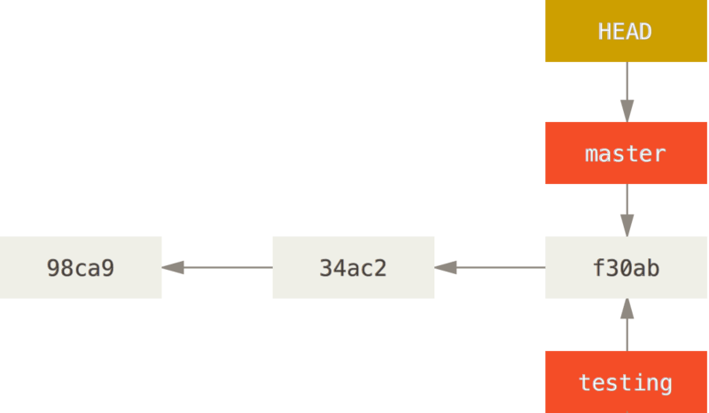
- **HEAD**는 현재 작업 중인 브랜치를 가리킨다.
- ```git branch``` 명령은 브랜치를 만들기만 하고 HEAD를 옮기지 않는다.
#### 브랜치 이동하기
```
$ git checkout testing
```

- 이 상태에서 커밋을 하면 ```testing``` 브랜치의 커밋 체크섬이 갱신된다.
  ```
  $ vim test.rb
  $ git commit -a -m 'made change'
  ```
  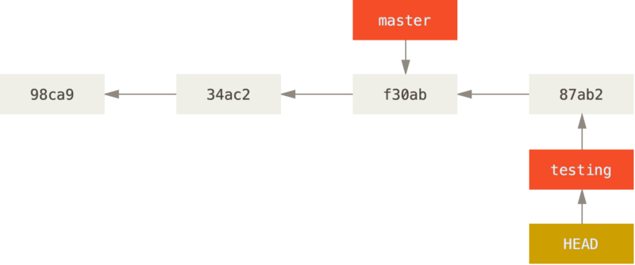
- 다시 ```master``` 브랜치로 이동하면, 아래와 같다.
  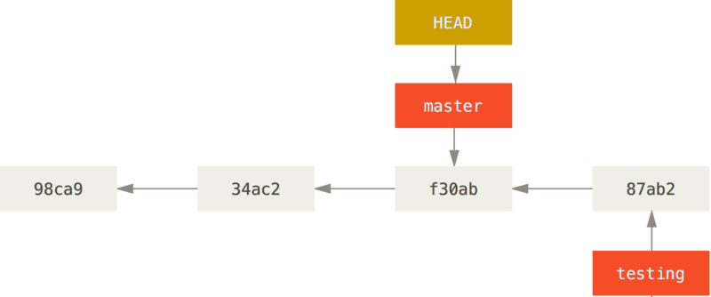
  **cf )** 브랜치를 이동하면 워킹 디렉토리의 파일이 해당 브랜치에서 마지막으로 한 작업으로 변경된다.
- 이제 ```master``` 브랜치에 새로 커밋하면, 브랜치가 둘로 갈라진다.
  ```
  $ vim test.rb
  $ git commit -a -m 'other change'
  ```
  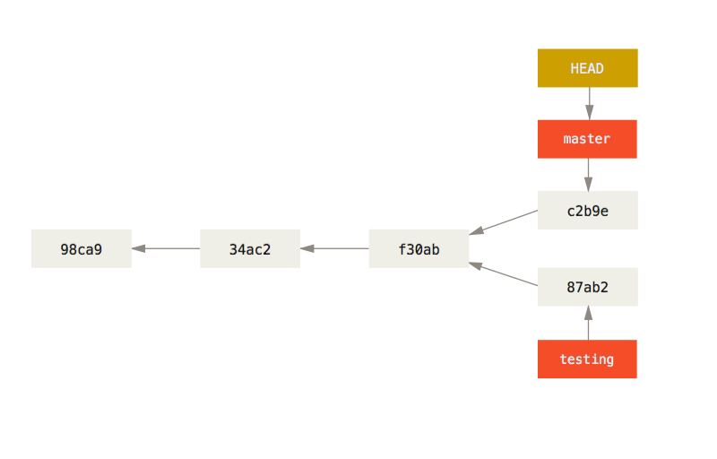

### 브랜치와 Merge의 기초
-----------------------------------------------------------
#### <예제>
새로운 이슈를 처리하기 위해 브랜치를 만들어 작업하던 중, 중요한 문제가 생겨 핫픽스를 먼저 만들어야 하는 상황

### 브랜치의 기초
- **초기 상황**
  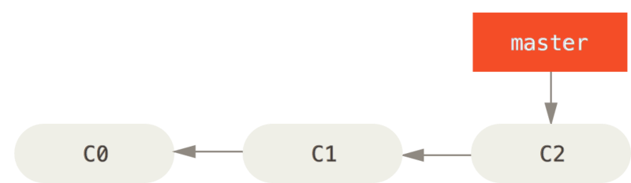
<br/><br/>

- **새로운 53번 이슈를 처리하기 위한 브랜치 생성**
  ```
  $ git checkout -b iss53
  (checkout: 브랜치 이동, -b: 브랜치 생성)
  ```
  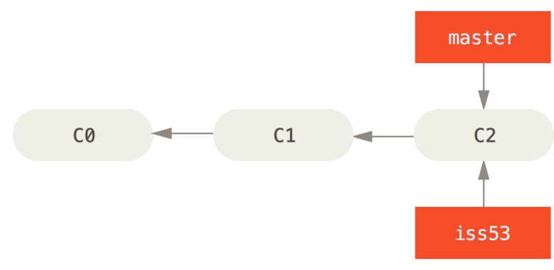
<br/><br/>

- **새로운 브랜치 포인터 생성**
  ```
  $ vim index.html (파일 수정)
  $ git commit -a -m 'added a new footer [issue 53]'
  ```
  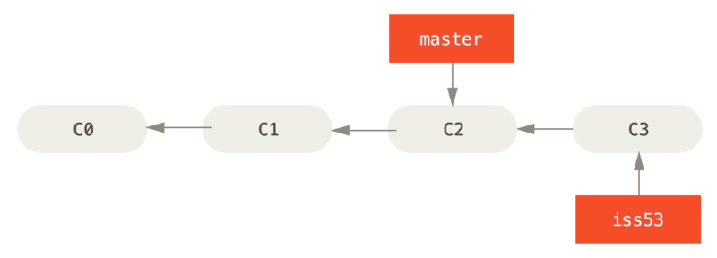
<br/><br/>

- **핫픽스 브랜치 생성**
  - 사이트에 버그가 발생한 경우, 핫픽스를 만들기 위해 ```master``` 브랜치로 돌아간다.
    ```
    $ git checkout master

    cf. 아직 커밋하지 않은 파일이 checkout하려는 파일과 충돌하는 경우, 브랜치를 변경할 수 없다. 여기서는 일단 작업하던 것을 모두 커밋하고 master 브랜치로 이동한다.
    ```

  - 이 경우, 워킹 디렉토리는 자동으로 53번 이슈를 시작하기 전의 상태로 돌아간다.
  
  - ```hotfix``` 브랜치를 새로 만든다.
    ```
    $ git checkout -b hotfix
    $ vim index.html
    $ git commit -a -m 'fixed the broken email address'
    ```
    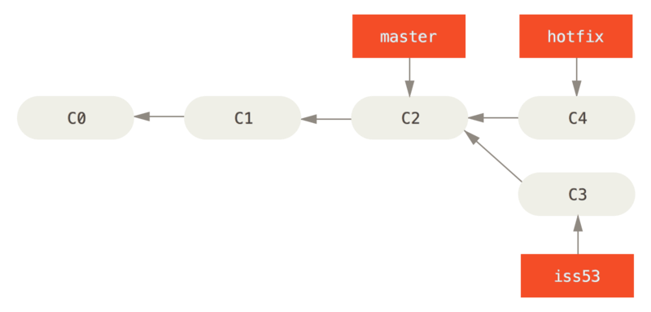
<br/><br/>

- **핫픽스 배포를 위한 Merge**
  - 핫픽스를 합칠 브랜치( ```master``` )로 이동하여 merge 한다.
    ```
    $ git checkout master
    $ git merge hotfix
    Fast-forward
    index.html | 2 ++
    1 file changed, 2 insertions(+)
    ```
    - ```hotfix``` 브랜치가 가리키는 C4 커밋은 C2 커밋에 기반하였으므로, Merge 과정 없이 브랜치 포인터만 C4로 이동한다. 이를 **"Fast forward"** 라고 한다.
    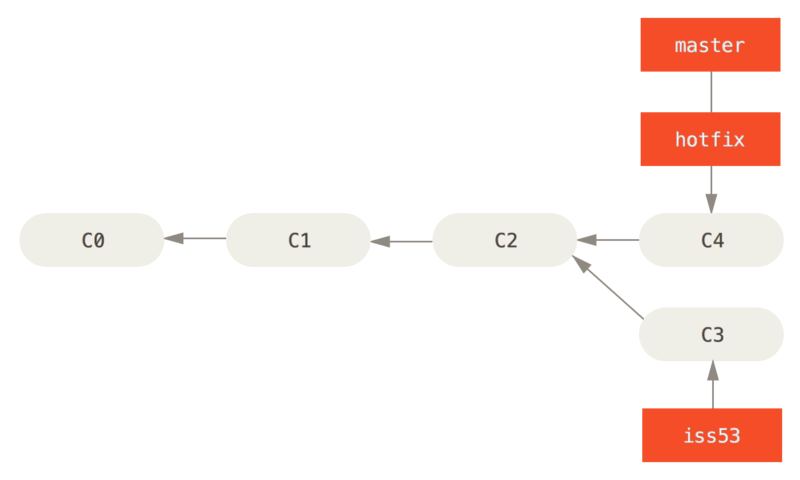
  - ```hotfix``` 브랜치는 더 이상 필요없으니 제거하고 53번 이슈를 처리하던 환경으로 이동해 작업을 이어간다.
    ```
    $ git checkout iss53
    Switched to branch "iss53"
    $ vim index.html
    $ git commit -a -m 'finished the new footer [issue 53]'
    [iss53 ad82d7a] finished the new footer [issue 53]
    1 file changed, 1 insertion(+)
    ```
    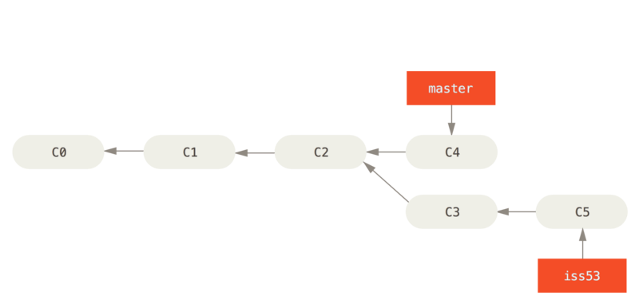
<br/><br/>

### Merge의 기초
- **53번 이슈를** ```master``` **브랜치에 Merge한다.**
  
  - 이때, 현재 브랜치가 ```master``` 브랜치의 조상이 아니기 때문에, Fast forward 방식으로 Merge되지 않고 **3-way Merge**가 이루어진다.
  
    ```
    $ git checkout master
    Switched to branch 'master'
    $ git merge iss53
    Merge made by the 'recursive' strategy.
    index.html |    1 +
    1 file changed, 1 insertion(+)
    ```
    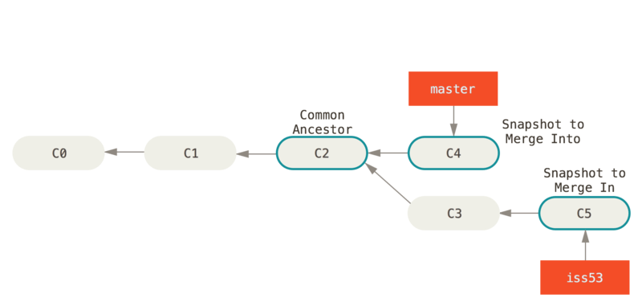
<br/><br/>

  - 3-way Merge는 커밋 3개를 병합하는 별도의 커밋을 생성한다.
  
    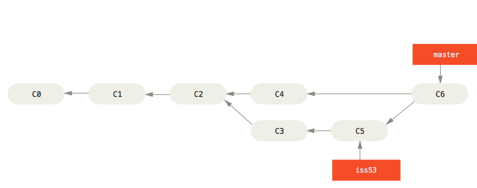
<br/><br/>

  - ```iss53``` 브랜치는 이제 필요없으므로 제거한다.
    ```
    $ git branch -d iss53
    ```
<br/>

### 충돌의 기초
- Merge하는 두 브랜치에서 같은 파일의 한 부분을 동시에 수정하면 Merge에 실패한다.
  ```
  $ git merge iss53
  Auto-merging index.html
  CONFLICT (content): Merge conflict in index.html
  Automatic merge failed; fix conflicts and then commit the result.
  ```

- 이 때, ```git status```를 이용하면 어느 파일에서 충돌이 일어났는지 알 수 있다.
  ```
  $ git status
  On branch master
  You have unmerged paths.
    (fix conflicts and run "git commit")

  Unmerged paths:
    (use "git add <file>..." to mark resolution)

      both modified:      index.html

  no changes added to commit (use "git add" and/or "git commit -a")
  
  <<<<<<< HEAD:index.html
  <div id="footer">contact : email.support@github.com</div>
  =======
  <div id="footer">
   please contact us at support@github.com
  </div>
  >>>>>>> iss53:index.html

  <충돌 내용 설명>
  ======= 윗부분: HEAD 버전(master) 내용
  ======= 아랫부분: iss53 내용
  ```
- 충돌 부분을 수정하고 다시 Staging Area에 저장한다. 충돌을 해결했으면 Merge 내용을 커밋한다.
  ```
  (출력 메시지)
  Merge branch 'iss53'

  Conflicts:
      index.html
  #
  # It looks like you may be committing a merge.
  # If this is not correct, please remove the file
  #	.git/MERGE_HEAD
  # and try again.


  # Please enter the commit message for your changes. Lines starting
  # with '#' will be ignored, and an empty message aborts the commit.
  # On branch master
  # All conflicts fixed but you are still merging.
  #
  # Changes to be committed:
  #	modified:   index.html
  #
  ```