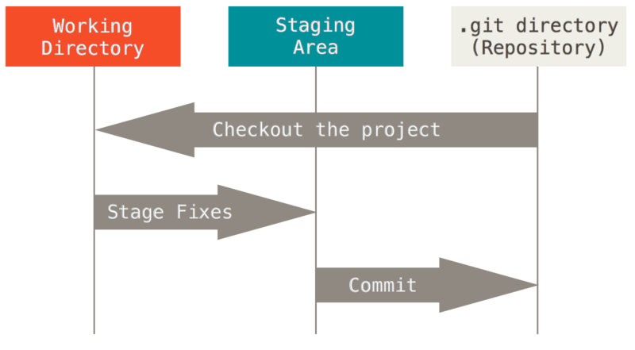
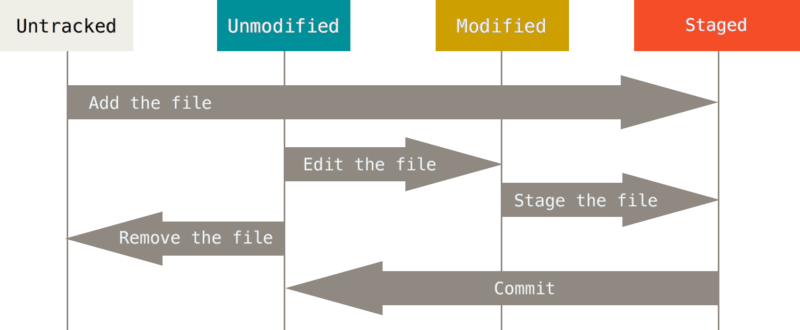

what is a Git?
============

## Git의 세 가지 상태
1. **Committed** : 데이터가 *로컬 데이터베이스* (Git 디렉토리)에 저장되어 있음을 의미한다.

2. **Modified** : 수정한 파일을 아직 로컬 데이터베이스에 커밋하지 않은 상태이다.

3. **Staged** : 현재 수정한 파일을 커밋하기 위해 Staging Area에 올려 둔 상태이다.
<br/><br/>



## 시작하기
### 사용자 정보 설정
- 사용자 정보는 Git을 설치한 뒤 한 번만 설정하면 된다.
```
$ git config --global user.name "username"
$ git config --global user.email id@example.com
```
- 설정 확인은 ```git comfig --list```로 하면 된다.

### Git 저장소 만들기
- 아직 버전 관리를 하지 않는 로컬 디렉토리 하나를 Git 저장소에 연동하는 방법
  
    1. 원하는 디렉토리로 이동하여 다음 명령어를 실행한다.
       ```
       $ git init (하위 디렉토리인 .git을 만드는 명령)
       ```
    2. ```git add```와 ```git commit``` 명령으로 파일을 추가 및 커밋한다.
       ```
       $ git add *.c
       $ git add LICENCE
       $ git commit -m 'initial project version'
       ```
- Git 저장소를 Clone하는 방법
  
    - ```git clone``` 명령어 이용
      ```
      $ git clone <url> <directory_name>
      ```

### 수정 및 저장소에 저장
- **Tracked file** vs **Untracked file**
  
  Tracked : 이미 스냅샷에 포함되어 있던 파일, Unmodified와 Modified로 나뉨
  
  Unmodified : 수정하지 않은 파일

  Modified : 수정한 파일

  

### 파일 상태 확인하기
```
$ git status
(실행 메시지)
On branch master
Your branch is up-to-date with 'origin/master'.
nothing to commit, working directory clean
```